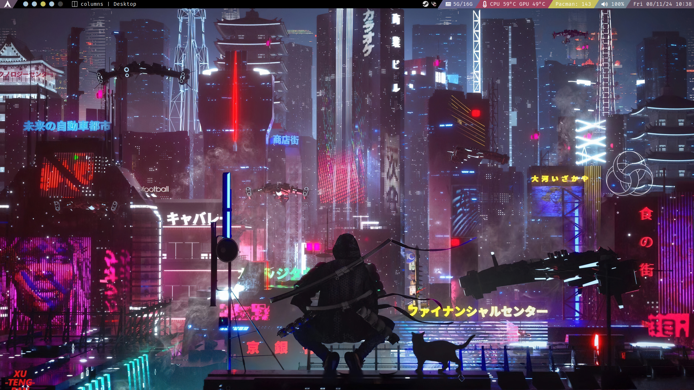
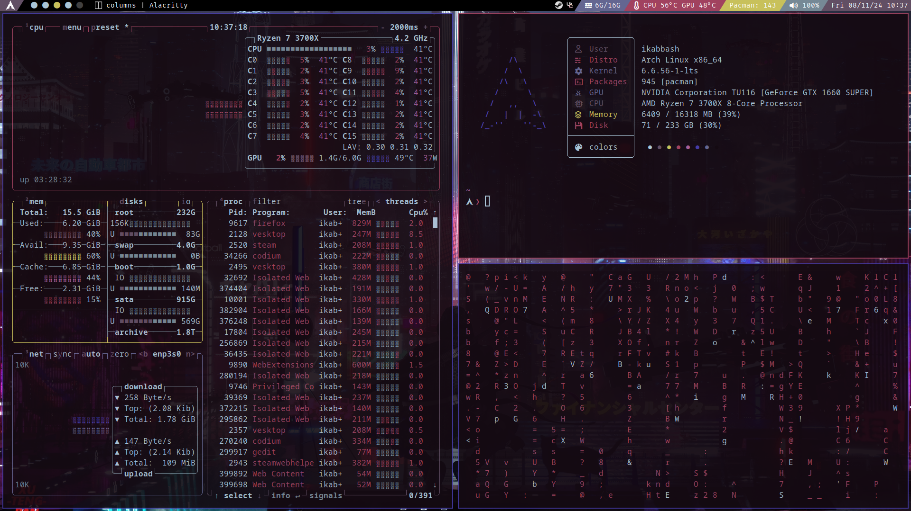
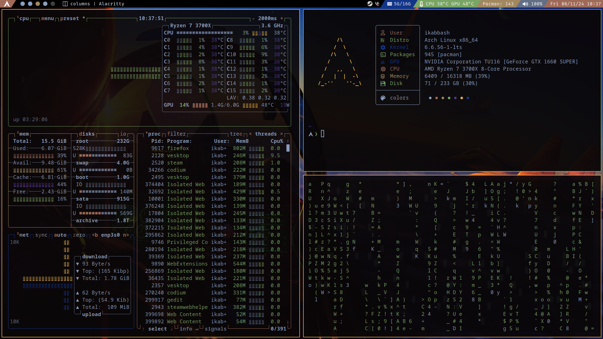
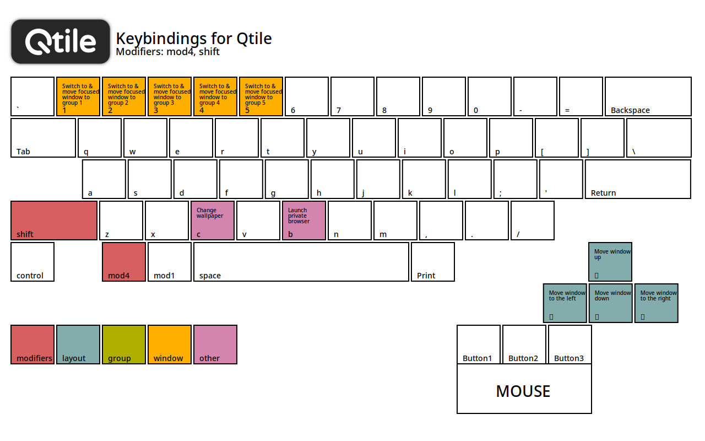
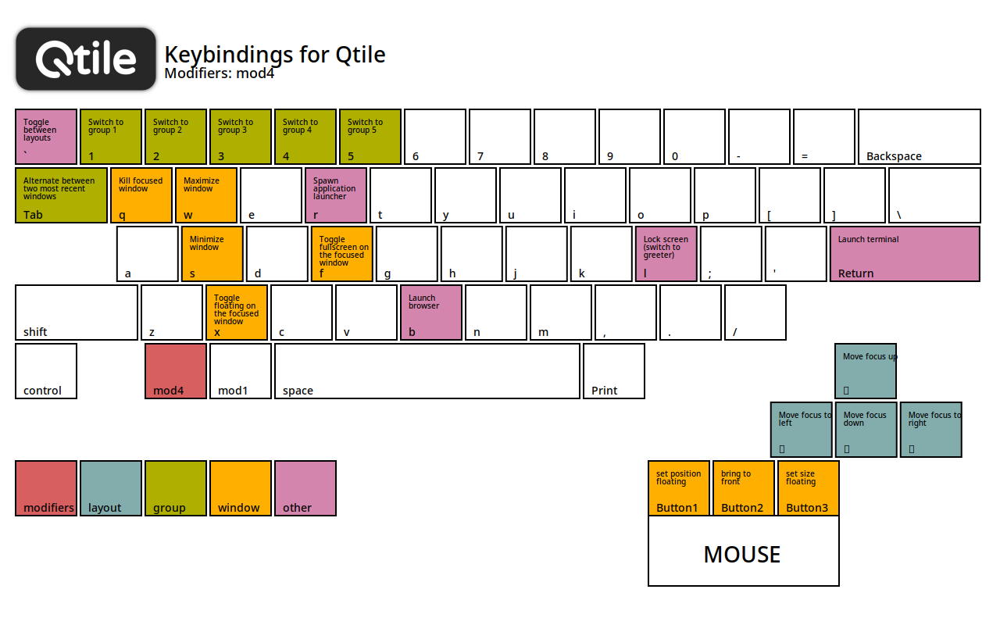

# Dotfiles
This is my first personal setup, you can use the configs and modify them freely. Terminal and bar color scheme change based on wallpaper colors using [Pywal](https://github.com/dylanaraps/pywal)

- [Screenshots](#screenshots)
- [Info](#info)
- [Setup](#setup)
    - [Installation](#installation)
    - [Notes](#notes)
    - [Keybindings](#keybindings)


## Screenshots

<br><br>

<br><br>



## Info
- Linux Distro: Arch Linux 
- Window Manager: [Qtile](https://github.com/qtile/qtile) with [qtile-extras](https://github.com/elParaguayo/qtile-extras)
- Bar: Qtile's bar
- Terminal: Alacritty
- Shell: Bash
- Shell Prompt: [Starship](https://starship.rs/guide/)
- Launcher: [Rofi](https://github.com/davatorium/rofi)
- File Manager: Thunar
- Fetch: [Catnap](https://catnap-fetch.xyz/)
- Screenshot Software: [Flameshot](https://flameshot.org/docs/installation/installation-linux/)
- Display Server: X11


## Setup
If its your first time setting up Qtile, I recommend checking DistroTube's [videos](https://youtube.com/playlist?list=PL5--8gKSku15-C4mBKRpQVcaat4zwe4Gu&si=6cVoNKLqnXMzJIjH)

### Installation
Install these packages using `pacman` if you're on Arch Linux
```
sudo pacman -S \
	git curl zip \
	gzip rsync man \
	bash-completion \
	qtile feh thunar \
	rofi python-pywal \
	python-psutil starship \
	ttf-nerd-fonts-symbols \
	papirus-icon-theme \
	ttf-font-awesome \
	cmatrix feh pavucontrol \
	khal tumbler imagemagick

yay -S qtile-extras catnap-git
```

- [feh](https://wiki.archlinux.org/title/Feh): Changes wallpaper
- [python-psutil](https://archlinux.org/packages/extra/x86_64/python-psutil/): Qtile built-in resource monitoring
- [papirus-icon-theme](https://archlinux.org/packages/extra/any/papirus-icon-theme/): Free and open source SVG icon theme
- [ttf-font-awesome](https://archlinux.org/packages/extra/any/ttf-font-awesome/): An icon library
- [pywal](https://archlinux.org/packages/extra/any/python-pywal/): Changes terminal colors according to wallpaper’s colors
- [cmatrix](https://github.com/abishekvashok/cmatrix): Matrix like effect in terminal 
- [pavucontrol](https://archlinux.org/packages/extra/x86_64/pavucontrol/): Pulse audio volume control with an interface
- [khal](https://archlinux.org/packages/extra/any/khal/): Calendar in terminal (appears when you click on date in the Qtile bar)
- [tumbler](https://archlinux.org/packages/extra/x86_64/tumbler/): Thumbnail viewer on file managers

### Notes
- [Pywal](https://github.com/dylanaraps/pywal) is now archived on Github and no longer maintained
- To change Rofi theme check this [repo](https://github.com/newmanls/rofi-themes-collection) and follow the documentation
- To change windows appearance (including file manager), install `lxappearance` for GTK and choose a [theme](https://aur.archlinux.org/packages?K=gtk-theme)
- Make sure you have `~/Pictures/wallpapers` directory where your wallpapers are stored, or change the path in `qtile/wallpaper_change.sh` script accordingly
- The preset used for Starship is [Bracketed Segments](https://starship.rs/presets/bracketed-segments)
- Switch to greeter keybinding is commented in case anyone's using a different greeter
- You may consider modifying the `config.py` if you use a different browser, screenshot tool, launcher, etc..


### Keybindings

| Keybinding               | Action Description                                             |
|--------------------------|----------------------------------------------------------------|
| `Super + Left`           | Move focus to the left                                        |
| `Super + Right`          | Move focus to the right                                       |
| `Super + Down`           | Move focus down                                               |
| `Super + Up`             | Move focus up                                                 |
| `Super + Tab`            | Alternate between two most recent windows                     |
| `Super + Grave`          | Toggle between layouts                                        |
| `Super + q`              | Kill focused window                                           |
| `Super + f`              | Toggle fullscreen on the focused window                       |
| `Super + x`              | Toggle floating on the focused window                         |
| `Super + w`              | Maximize window                                               |
| `Super + s`              | Minimize window                                               |
| `Super + Return`         | Launch terminal                                               |
| `Super + r`              | Spawn application launcher (Rofi)                             |
| `Super + b`              | Launch browser (Firefox)                                      |
| `Super + Shift + Left`   | Move window to the left                                       |
| `Super + Shift + Right`  | Move window to the right                                      |
| `Super + Shift + Down`   | Move window down                                              |
| `Super + Shift + Up`     | Move window up                                                |
| `Super + Shift + b`      | Launch private browser (Firefox in private mode)              |
| `Super + Shift + c`      | Change wallpaper using custom script                          |
| `Super + Control + Left` | Grow window to the left                                       |
| `Super + Control + Right`| Grow window to the right                                      |
| `Super + Control + Down` | Grow window down                                              |
| `Super + Control + Up`   | Grow window up                                                |
| `Super + Control + Tab`  | Reset all window sizes                                        |
| `Super + Control + r`    | Reload the config                                             |
| `Print`                  | Take screenshot using Flameshot                               |


<br><br>
